# PRAKTIKUM MODUL 2 PROBSTAT 2022

## Soal 1
```R
orang.ke = c(seq(1:9))
kso.sebelum = c(78,75,67,77,70,72,78,74,77)
kso.sesudah = c(100,95,70,90,90,90,89,90,100)
data = data.frame(orang.ke, kso.sebelum, kso.sesudah)
```

a.
```R
sd = sd(data$kso.sesudah-data$kso.sebelum)
sd
```
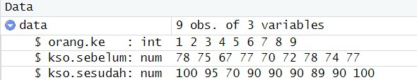

b.
```R
t.test(data$kso.sesudah, data$kso.sebelum, paired = TRUE)
```
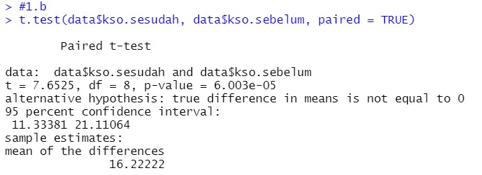

c.
```R
t.test(data$kso.sesudah, data$kso.sebelum, paired = TRUE, 
       alternative = "two.sided", conf.level = 0.95)
```
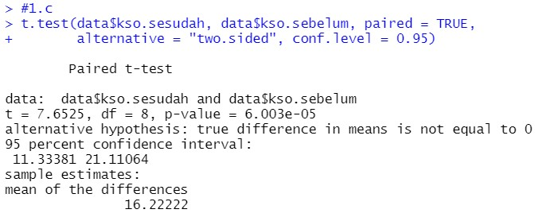
Berdasarkan output yang dihasilkan, diperoleh nilai thitung = 7.6525,
dengan derajat bebas 8 dan nilai p-value < 6.003e-05, Dari hasil tersebut dapat menolak hipotesis awal dan disimpulkan bahwa terdapat cukup
bukti di mana ada pengaruh yang signifikan secara statistika dalam hal kadar saturasi
oksigen, sebelum dan sesudah melakukan aktivitas A

## Soal 2
```R
zsum.test(mean.x=23500, sigma.x = 3900, n.x = 100,  
          alternative = "greater", mu = 20000)
```
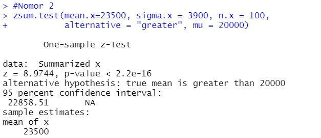
a. Ya setuju
b. Berdasarkan output yang dihasilkan, diperoleh nilai thitung = 8.9744, p-value < 2.2e-16, juga peroleh selang
kepercayaan berkisar di antara 22858.51 sampai tak hingga, dengan selang kepercayaan 95%
c. p-value < 2.2e-16 atau sekitar 0, Dari hasil tersebut dapat menolak hipotesis awal dan disimpulkan bahwa 
mobil dikendarai rata-rata lebih dari 20.000 kilometer per tahun

## Soal 3
```R
tsum.test(mean.x=3.64, s.x = 1.67, n.x = 19, 
          mean.y =2.79 , s.y = 1.32,
          n.y = 27, alternative = "two.sided", 
          mu = 0, var.equal = TRUE,
          conf.level = 0.95)
```
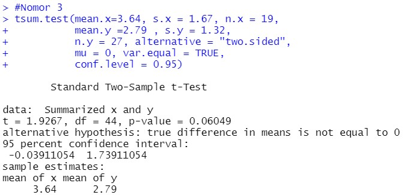

## Soal 4
Membagi menjadi 3 grup
```R
my_data <- read.delim(file.choose())

my_data$Group = as.factor(my_data$Group)
my_data$Group = factor(my_data$Group,labels = c("kucing oren", "kucing hitam", "kucing putih"))

class(my_data$Group)

Group1 = subset(my_data, Group == "kucing oren")
Group2 = subset(my_data, Group == "kucing hitam")
Group3 = subset(my_data, Group == "kucing putih")
```
a.
```R
qqnorm(Group1$Length)
qqline(Group1$Length)

qqnorm(Group2$Length)
qqline(Group2$Length)

qqnorm(Group2$Length)
qqline(Group2$Length)
```

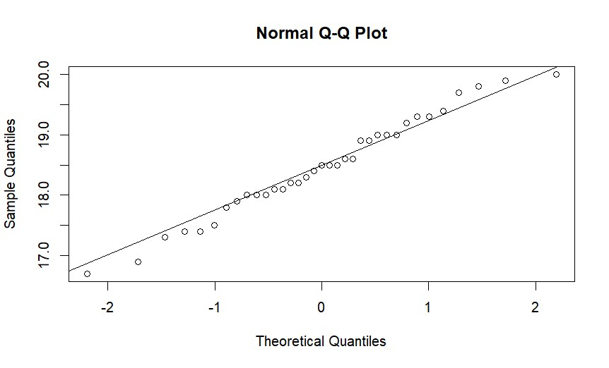
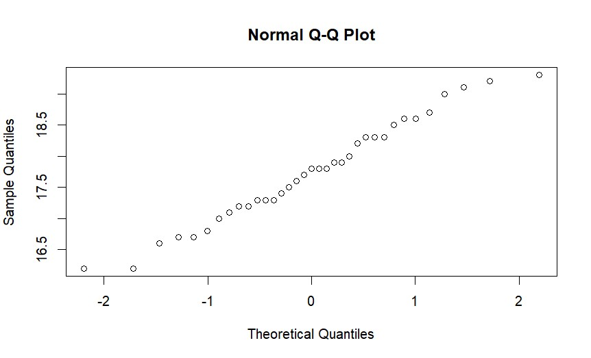
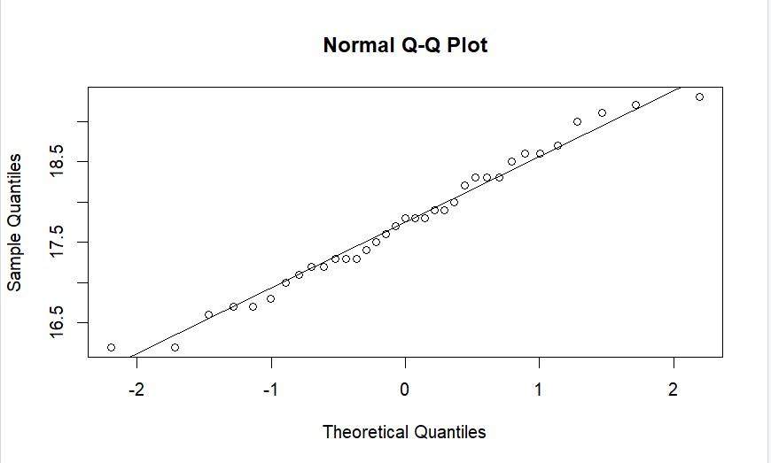
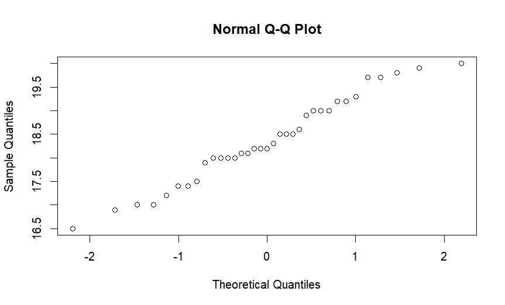
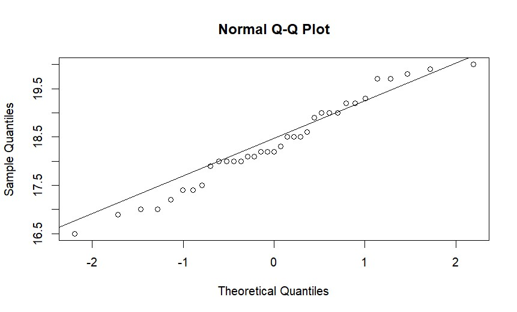

b.
```R
bartlett.test(Length ~ Group, data = my_data)
```
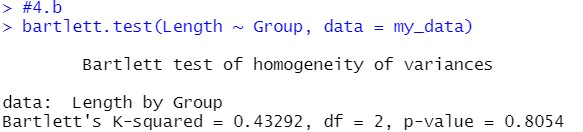
Didapat hasil p-value = 0.8054, Dari hasil tersebut dapat menolak hipotesis awal dan disimpulkan ada perbedaan panjang antara ketiga spesies atau rata-rata panjangnya berbeda

c.
```R
model1 = lm(Length ~ Group, data = my_data)
```

d.
```R
anova(model1)
```
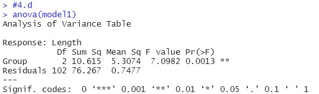
Didapat nilai p = 0.0013, Dari hasil tersebut dapat menolak hipotesis awal dan disimpulkan ada perbedaan panjang antara ketiga spesies atau rata-rata panjangnya berbeda

e.
```R
TukeyHSD(aov(model1))
```
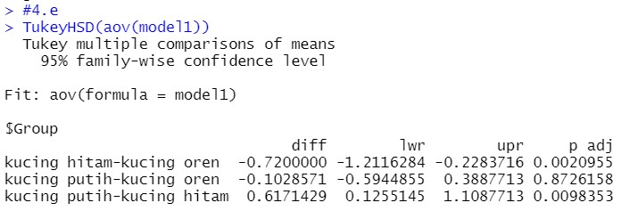
Dapat dilihat pada nilai p satu jenis kucing lebih panjang dari yang lain

f. 
```R
install.packages("ggplot2")
library("ggplot2")

ggplot(my_data, aes(x = Group, y = Length)) +
  geom_boxplot(fill = "lightblue", colour = "black") +
  scale_x_discrete() + xlab("spesies") +
  ylab("panjang")
```
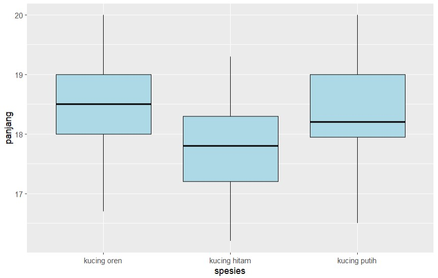
